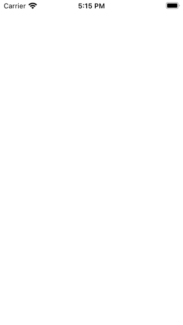

# AnimatableCountdownTimer
This repository contains examples of the animatable countdown timer and current time written in SwiftUI.

### License
MIT License

### Questions?
Feel free to [create an issue](https://github.com/dantish/AnimatableCountdownTimer/issues)
